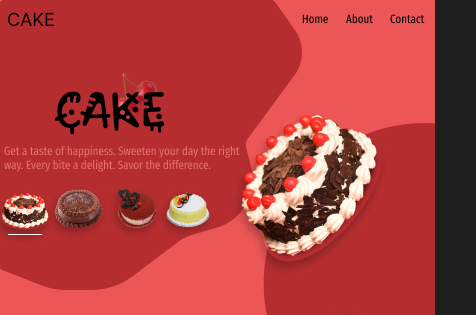
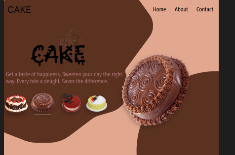
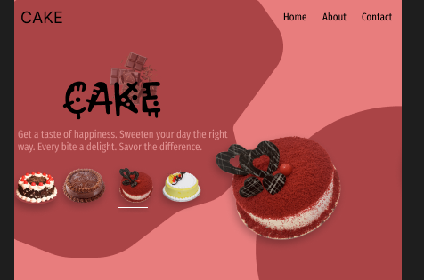
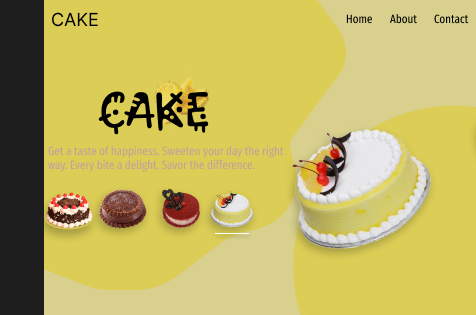

# CakeRush-Online-Cake-Delivery-App-UI-Design

This is a UI/UX design prototype for CakeRush, a modern online cake ordering and delivery app designed using Figma. The purpose of this app is to simplify the way people celebrate moments by making cake ordering fast, personalized, and delightful. From birthdays to weddings, or just sudden cravings — users can explore a wide variety of cakes, read product details, customize flavors, and place an order with just a few taps. The design focuses on clean layouts, easy navigation, and a joyful visual experience that enhances user trust and satisfaction.
The main goal behind this project is to bridge the gap between bakeries and customers through a digital platform that ensures convenience, speed, and celebration at your doorstep. Whether it's midnight delivery or same-day surprise gifting, the app is designed to deliver happiness — one cake at a time.

## 📸 UI Screens Preview

<table>
  <tr>
    <td><b>Chocolate Cake</b></td>
    <td><b>Red Velvet Cake</b></td>
  </tr>
   <tr>
    <td></td>
    <td></td>
  </tr>
  <tr>
    <td><b>Black Forest Cake</b></td>
    <td><b>Pineapple Cake</b></td>
  </tr>

  <tr>
    <td></td>
    <td></td>
  </tr>
</table>

## 📸 Preview

## 🔗 Live Prototype (Figma)

🔧 Tools Used:
Figma
UI/UX Design Principles

